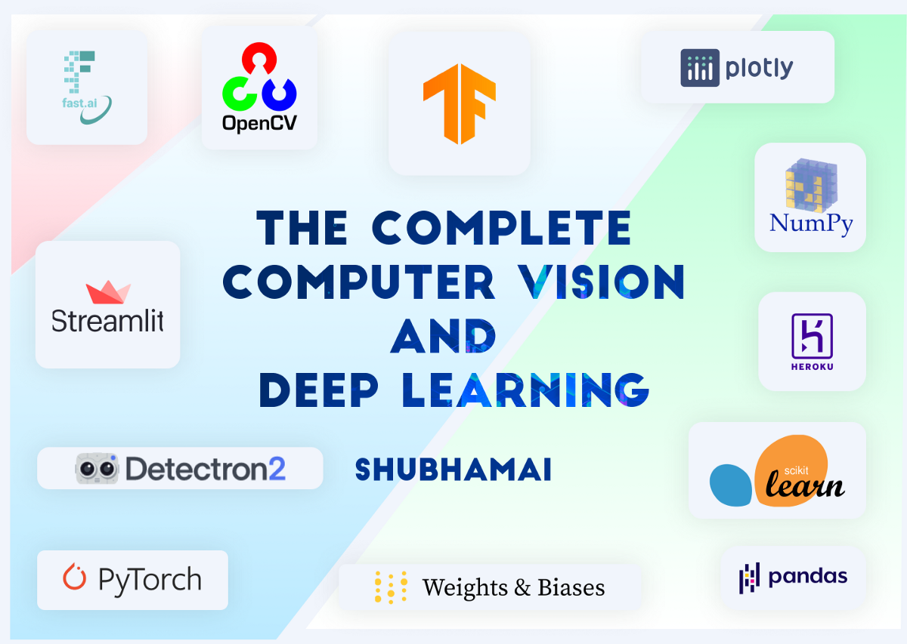

### Hi there 👋 Me Shubhamai
> Machine Learning Engineer 🧠 • [Instructor](https://www.udemy.com/user/shubham-gupta-403/) 🎓 • Teaching Assistant & Mentor @ [ZTM](https://zerotomastery.io/) • ML Researcher @ [AIcrowd](https://www.aicrowd.com/) • Love Space & Rocketry 🚀

I am Machine Learning Engineer & Instructor with having a lot of experience with Deep Learning, Computer Vision. 

Currently, I am been working as Machine learning Teaching Assistant @ [Zero to Mastery](https://zerotomastery.io/) and Machine Learning Research Assistant @ [AIcrowd]((https://www.aicrowd.com/)) . 

I started my journey as an ML Engineer when I discovered Arduino, one of the most popular microcontrollers that can be used anywhere like in hobby projects or in robotics. With programming c++ in Arduino. I started to question myself about how can I increase my software development skills. and that's where I discovered and started learning python & ML,  self-taught. I completed many many courses. You can find all of them [here](https://shubhamai.com/my-story-to-become-machine-learning-engineer-shubhamai/index.html). 

I then started building many projects which you can find [here](https://github.com/Shubhamai) and Then I started freelancing on Fiverr. I got so much experience working with companies and their projects, and go many reviews too like —

> Amazing developer to work with. Great experience, he went above and beyond to create great code that is clean and efficient. Will work with this developer again! - scifundinc

> Shubham is very keen to work on all the aspects mentioned. He takes his time to make the project appealing and accurate. He was very committed to the time limit given and delivered the project before the deadline. His work is commendable and I look forward to take up more projects from him. - swantikalabh

 

and many many more...

After that I started learning many more skills, ( by the way, you can all of my technical details [here](https://shubhamai.com/experience/) )  like object detection & segmentation, using Detectron2, FastAI, and many advanced techniques in deep learning including working on many kaggle competitions. 

But after that, working for endless months, I finally published my first ever online course, [The Complete Deep Learning & Computer Vision Course](https://www.udemy.com/course/dlcourse/?referralCode=1B0F4190621EDAD897D1) and started my carer as an Instructor.  I made this course keeping in mind that this course is what i wanted when i started to learn Deep Learning & Computer Vision. 

And then, here we are...
